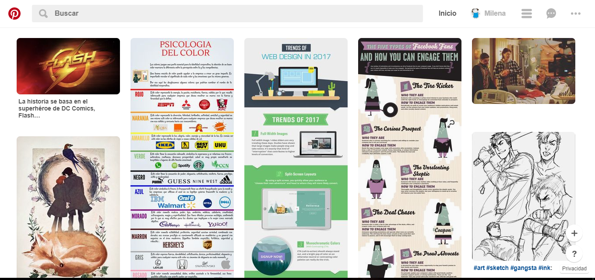
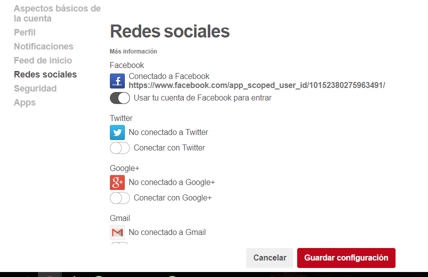
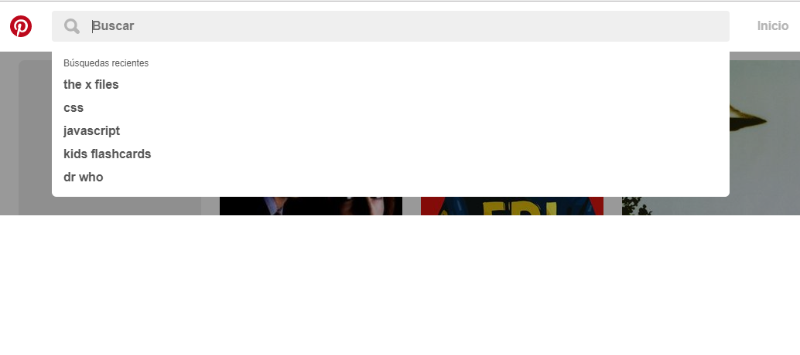
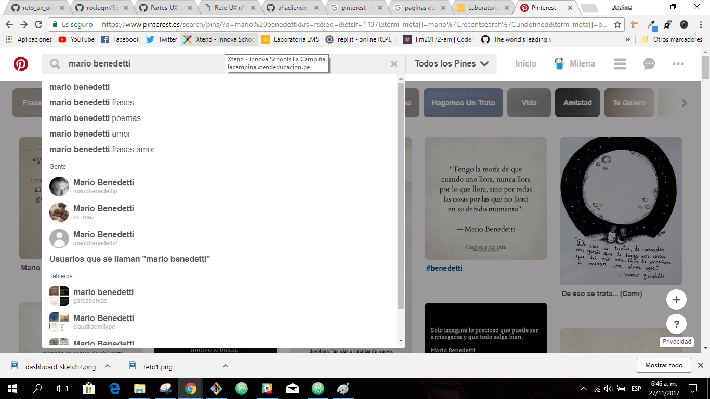

###Sprint 2. Reto Analizar un sitio web**   

**Características UX  del sitio web Pinterest**

+ Pinterest es un servicio de "image bookmarking" que utiliza un concepto similar al estilo "Masonry layout" Masonry es una biblioteca de diseño de cuadrícula de JavaScript. Funciona al colocar los elementos en una posición óptima en función del espacio vertical disponible, algo así como ladrillos en una pared.
+ Pinterest mantiene la atención del usuario por horas debido a un display amigable de imágenes más el scroll infinito.

+ El usuario puede acceder a su cuenta Pinterest a través de otras redes sociales, haciendo que el momento del login sea más rápido y fácil.

+ La navegación en el site esta realizada por medio de la barra de búsqueda. En ella se ingresa el criterio deseado y al dar enter aparecerán los pines que cubran el criterio. De igual manera Pinterest nos sugiere categorías que podrían ser de interes del usuario basado en sus busquedas previas.

+ Se organizan los intereses de los usuarios en base a los criterios individuales de busqueda. Cada usuario puede crear "boards" (tableros) y almacenar las imágenes previamente selecciondas (pinned).

+ Otra facilidad que se le brinda al usuario es la de seguir a uno o más  usuarios y que éstos los seguan a su vez. El intercambio de ideas, arte y gustos afines ha hecho que este sitio web se popularize en forma rápida.

### UI
 **Características UI  del sitio web Pinterest**

Son características UI:
-Los colores seleccionados para el fondo, las barras y las letras. Se hace uso de los grises en lo que son las barras de búsqueda mientras que el blanco se reserva para el fondo de la pantalla.

El diseño redondeado y amigable de los botones al igual que el color de fondo de los mismos. Los botones pueden ser cambiados por el usuarios.

El tipo de font y color de las letras. Así como también el logo de Pinterest.
